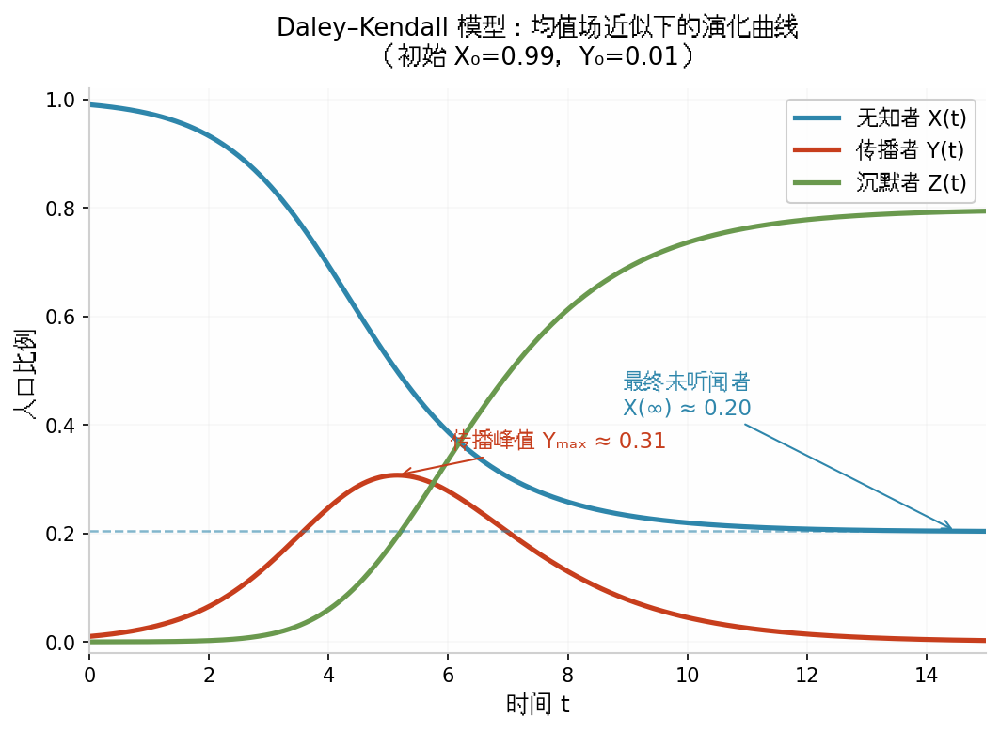

# 53Daley–Kendall 谣言传播模型（数学模型）

**姓名：**付初琰  

**学号：**202419263007 

**班级：**24数科一班

## 一、定义

**Daley–Kendall（DK）谣言传播模型**是 Daley 与 Kendall 于 20 世纪 60 年代提出的经典信息扩散模型，用于描述封闭人群中谣言经由个体接触而传播、扩散并最终停止的动态过程。

模型将个体划分为三类状态：

- $I$（Ignorant）：未知者，尚未听闻谣言；
- $S$（Spreader）：传播者，已知晓谣言且仍在传播；
- $R$（Stifler）：停止传播者，已知晓谣言但不再主动传播。

DK 模型关注的是**传播动力学**，而非判断信息真伪。其核心在于：传播者遇到未知者时产生新的传播者；遇到已知情者时，传播者可能退出传播状态。

### 状态转移

经典 DK 模型包含三类核心接触：

$$
I+S\rightarrow S+S
$$

$$
S+S\rightarrow R+R
$$

$$
S+R\rightarrow R+R
$$

分别表示：未知者获得信息、两个传播者同时停止传播、传播者因接触已知情者而停止传播。

---

## 二、背景和上下文

DK 模型产生于数学流行病学发展的背景下。疾病传播与信息传播都可以表示为个体状态随社会接触而发生转移，因此，流行病学中的分舱建模思想可以用于描述谣言扩散。[1][2]

1964 年，Daley 与 Kendall 在 *Nature* 发表 *Epidemics and Rumours*，讨论了流行病与谣言传播之间的数学类比；1965 年进一步在 *Stochastic Rumours* 中建立随机谣言传播模型。[1][2]

DK 模型的重要性主要在于：它建立了较为简洁的谣言传播动力学框架，并揭示了一个重要机制——**随着知情者增加，传播者越来越容易接触已经知情的个体，从而导致传播动力下降**。

其基本应用包括谣言传播、信息扩散和社会网络传播动力学研究。后续研究进一步将网络结构、个体异质性、事实核查、辟谣机制以及跨平台传播等因素纳入模型。[4][5][6][7][9]

---

## 三、举例说明

以校园中的一条未经证实的消息为例。假设初始只有少数学生知晓该消息，并主动向其他学生传播。

若传播者接触到未知者，则发生：

$$
I+S\rightarrow S+S
$$

传播者数量增加。

当传播范围扩大后，传播者越来越可能遇到已经听闻该消息的人。例如两个传播者相遇：

$$
S+S\rightarrow R+R
$$

两人均退出传播状态。

因此，整个传播过程通常经历：

$$
\text{传播者增加}
\rightarrow
\text{传播达到高峰}
\rightarrow
\text{传播者减少}
\rightarrow
\text{传播停止}
$$

这种“先扩散、后衰减”的过程正是 DK 模型所描述的基本传播动力学。

### 典型演化曲线

**图 1  Daley–Kendall 模型的典型状态演化曲线。**图中 $X(t)$、$Y(t)$、$Z(t)$ 分别表示未知者、传播者和停止传播者比例。可以看到，传播者比例先上升后下降，而未知者持续减少、停止传播者持续增加。

---

## 四、对比分析

### 4.1 DK 模型与 SIR 模型

DK 模型与经典 SIR 模型都采用三状态分舱结构，但状态转移机制不同。

| 比较维度 | SIR 模型 | DK 模型 |
|---|---|---|
| 第一状态 | 易感者 $S$ | 未知者 $I$ |
| 第二状态 | 感染者 $I$ | 传播者 $S$ |
| 第三状态 | 康复/移除者 $R$ | 停止传播者 $R$ |
| 核心过程 | 疾病传播 | 信息传播 |
| 第二状态退出 | 由恢复过程决定 | 与接触对象有关 |
| 第二状态之间接触 | 通常不产生特殊转移 | $S+S\rightarrow R+R$ |

因此，DK 模型虽然形式上类似 SIR，但其传播终止机制具有明显的**接触依赖性**。

### 4.2 DK 模型与 Maki–Thompson 模型

Maki–Thompson（MT）模型也是经典谣言传播模型。两者的重要区别在于传播者之间相遇时的处理方式：DK 模型规定两个传播者均转为停止传播者，而 MT 模型通常采用有方向的接触机制，仅使发起传播的一方退出传播状态。[3]

---

## 五、深入扩展：数学模型

设总人口为 $N$，定义：

$$
X(t)=\text{未知者人数},\qquad
Y(t)=\text{传播者人数},\qquad
Z(t)=\text{停止传播者人数}.
$$

满足人口守恒：

$$
X(t)+Y(t)+Z(t)=N.
$$

进一步定义比例变量：

$$
 x=\frac{X}{N},\qquad s=\frac{Y}{N},\qquad r=\frac{Z}{N},
$$

则：

$$
 x+s+r=1.
$$

在均匀混合和大人口近似下，DK 模型可表示为：

$$
\frac{dx}{dt}=-\beta xs,
$$

$$
\frac{ds}{dt}=\beta xs-\beta s(s+r),
$$

$$
\frac{dr}{dt}=\beta s(s+r).
$$

其中，$\beta>0$ 为接触传播强度参数。

由 $s+r=1-x$，可得：

$$
\frac{ds}{dt}=\beta s(2x-1).
$$

因此：

$$
 x>\frac12 \Rightarrow \frac{ds}{dt}>0,
$$

$$
 x<\frac12 \Rightarrow \frac{ds}{dt}<0.
$$

所以，**传播者比例在未知者比例下降到 $1/2$ 时达到峰值**。

进一步消去时间变量：

$$
\frac{ds}{dx}
=\frac{ds/dt}{dx/dt}
=\frac1x-2.
$$

积分得：

$$
 s=\ln x-2x+C.
$$

在经典大人口初始条件下，可取 $C=2$，于是：

$$
 s=\ln x-2x+2.
$$

传播最终停止时 $s\rightarrow0$，因此最终未知者比例 $x_\infty$ 满足：

$$
\ln x_\infty-2x_\infty+2=0.
$$

其非平凡根为：

$$
\boxed{x_\infty\approx0.2032}.
$$

即在经典确定性模型的该组假设下，最终约 **20.3%** 的个体未听闻该信息，而约 **79.7%** 的个体曾听闻该信息。

传播者峰值为：

$$
 s_{\max}=1-\ln2\approx0.3069.
$$

即理论上约有 **30.7%** 的人口同时处于传播状态。

需要注意，上述数值是经典确定性大人口近似的理论结果，并非现实社会中所有谣言传播的固定经验比例。

### 模型的主要假设与局限

DK 模型通常采用均匀混合、个体同质和状态转移规则固定等假设，因此未直接考虑网络拓扑、用户影响力差异、平台推荐、遗忘、主动辟谣以及信息语义等因素。现实舆情研究通常需要在此基础上进一步扩展。

---

## 六、现代发展及应用

DK 模型构成了谣言传播建模的基础框架。随着社交媒体、复杂网络和计算智能的发展，现代研究主要从“**网络结构、传播机制、跨平台传播、检测与控制**”四个方向扩展。

### 6.1 从均匀混合到复杂网络

经典 DK 模型假设个体均匀混合，而真实社交网络具有度分布不均、社区结构和节点影响力差异。因此，现代模型通常将传播过程映射到复杂网络，并进一步考虑**异质网络、时延、非线性传播率和高阶交互**等因素，以描述不同用户之间不均等的传播机会。[6][7][9]

### 6.2 从单一谣言传播到多机制耦合

现代模型不再只描述“谣言传播—停止传播”这一单一过程，而是将**辟谣、事实核查、信息反馈、心理因素和外部干预**纳入状态转移机制。例如，可增加“辟谣者”或“已核实者”等状态，研究谣言与辟谣信息之间的竞争关系，并通过最优控制方法分析干预时机和干预强度。[6][9]

### 6.3 从单平台传播到跨平台传播

社交媒体用户往往同时使用多个平台，信息可以在微博、微信、Facebook、X 等不同网络之间迁移。因此，近年来出现了**多层网络和跨平台谣言传播模型**，将不同平台表示为不同网络层，并通过跨层连接描述用户映射与信息耦合。相关研究进一步考虑平台结构差异、用户异质性以及跨层强化效应。[7]

### 6.4 从传播动力学到自动检测与治理

现代研究的应用目标已从解释“谣言如何传播”扩展到“**如何尽早发现并进行干预**”。传播路径、用户关系和时间演化可以构成谣言检测的重要特征；近年来，图神经网络（GNN）被用于建模传播图，Transformer 等预训练模型则用于提取文本语义信息，部分研究进一步探索图模型与大语言模型的结合。[8][10]

因此，当前研究可以形成如下技术链条：

$$
\boxed{\text{传播动力学模型}\rightarrow\text{传播网络建模}\rightarrow\text{谣言检测}\rightarrow\text{传播控制}}
$$

### 6.5 现实应用

DK 模型及其扩展主要应用于以下场景：

| 应用方向     | 主要任务                               |
| ------------ | -------------------------------------- |
| 社交媒体舆情 | 分析谣言的传播速度、规模与生命周期     |
| 突发事件治理 | 研究谣言与辟谣信息的竞争传播           |
| 传播预警     | 利用早期传播结构识别潜在谣言           |
| 干预策略     | 分析辟谣、媒体干预和用户教育的作用     |
| 跨平台治理   | 研究信息在不同社交平台之间的扩散与耦合 |

2026 年的一项系统综述指出，在线谣言控制研究正在从传统确定性分舱模型进一步发展到异质网络、外部干预和控制优化等方向，同时现实数据验证仍然不足。[9] 这说明 DK 模型目前更多承担的是**基础理论框架和机制基线**的角色，而不是对真实社交媒体传播过程的完整刻画。

-----------

## 七、简明总结

DK 模型的核心可以归纳为三点：

1. **三类状态**：未知者 $I$、传播者 $S$、停止传播者 $R$。
2. **三条规则**：

$$
I+S\rightarrow S+S,\qquad
S+S\rightarrow R+R,\qquad
S+R\rightarrow R+R.
$$

3. **核心动力学**：传播者先增长后衰减，最终趋于 0；在经典确定性模型中，传播者峰值对应 $x=1/2$，最终未知者比例约为 $0.2032$。

从理论上看，DK 模型揭示的是一个基本反馈过程：

$$
\boxed{
\text{知情者增加}
\rightarrow
\text{传播者更容易接触知情者}
\rightarrow
\text{传播动力下降}
}
$$

---

## 参考文献

[1] DALEY D J, KENDALL D G. Epidemics and Rumours[J]. *Nature*, 1964, 204: 1118. DOI: 10.1038/2041118a0.

[2] DALEY D J, KENDALL D G. Stochastic Rumours[J]. *IMA Journal of Applied Mathematics*, 1965, 1(1): 42–55. DOI: 10.1093/imamat/1.1.42.

[3] MAKI D P, THOMPSON M. *Mathematical Models and Applications: With Emphasis on the Social, Life, and Management Sciences*[M]. Englewood Cliffs, NJ: Prentice-Hall, 1973.

[4] PITTEL B. On a Daley-Kendall model of random rumours[J]. *Journal of Applied Probability*, 1990, 27(1): 14–27. DOI: 10.2307/3214592.

[5] KAWACHI K. Deterministic models for rumor transmission[J]. *Nonlinear Analysis: Real World Applications*, 2008, 9(5): 1989–2028. DOI: 10.1016/j.nonrwa.2007.06.004.

[6] RAPONI S, KHALIFA Z, OLIGERI G, et al. Fake News Propagation: A Review of Epidemic Models, Datasets, and Insights[J]. *ACM Transactions on the Web*, 2022, 16(3): 1–34. DOI: 10.1145/3522756.

[7] DING X, XING Q, DENG W, TIAN Y. Dynamics analysis of rumor propagation model in dual-layer heterogeneous social networks considering information coupling effect[J]. *Knowledge-Based Systems*, 2025, 323: 113829. DOI: 10.1016/j.knosys.2025.113829.

[8] AL-THULAIA F, HASHEMI GOLPAYEGANI S A. Graph-based approaches for rumor detection in social networks: a systematic review[J]. *Expert Systems with Applications*, 2025, 298: 129786. DOI: 10.1016/j.eswa.2025.129786.

[9] KARMAKER C L, AL AZIZ R, ARMAN M H, ZHUANG J. A Systematic Review of Controlling Rumors in Online Social Networks: Insights From Epidemiological Models[J]. *Risk Analysis*, 2026, 46: e70247. DOI: 10.1111/risa.70247.

[10] ANGGRAININGSIH R, HASSAN G M, DATTA A. Transformer-based models for combating rumours on microblogging platforms: a review[J]. *Artificial Intelligence Review*, 2024, 57: 212. DOI: 10.1007/s10462-024-10837-9.
